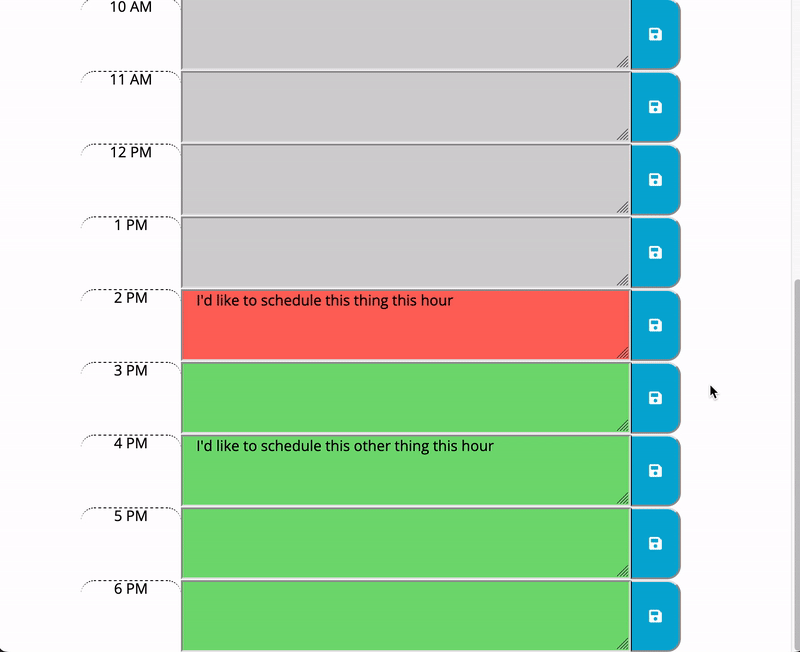

# 05-dayplanner
as an employee with scheduled events I want to add and remove events to a day planner so that I can manage my time effectively

## Description

This repository contains a productivity application that allows a user to list hourly agenda items for a particular day. The application uses local storage to maintain persistent data across browser sessions.

## Technologies
- HTML5
- CSS3
- JavaScript
- jQuery
- Moment.js

## Links
See it live:  [https://mcjbyday.github.io/05-dayplanner/](https://mcjbyday.github.io/05-dayplanner/)

    
## Screencapture
| Image | Description |
| --- | ----------- |
|  | Entering an agenda item |
|  ) | Viewing a saved agenda item |

## Other

No external installations are required to view this website. 

## Contact
Comments or questions?  
Author: Michael Jacobs  
Email: jacobsmichaelc@gmail.com  
GitHub: [https://github.com/mcjbyday](https://github.com/mcjbyday)  